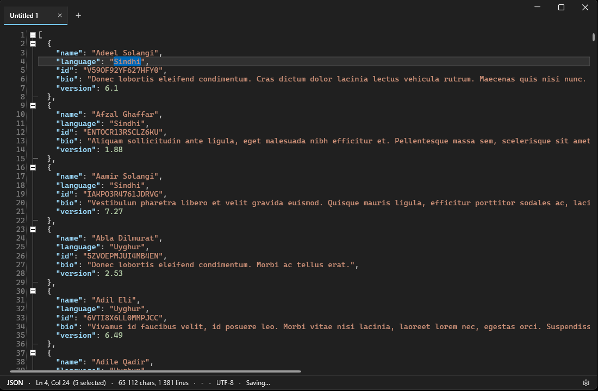
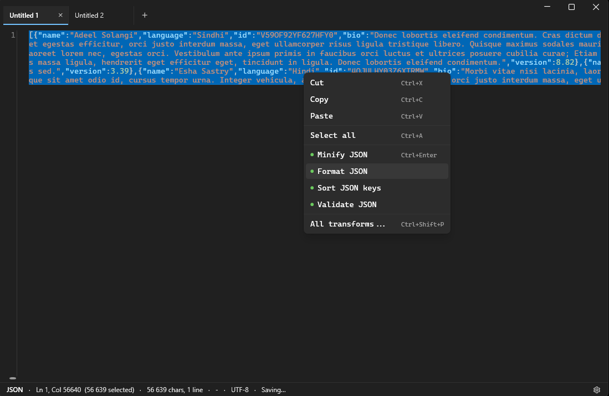
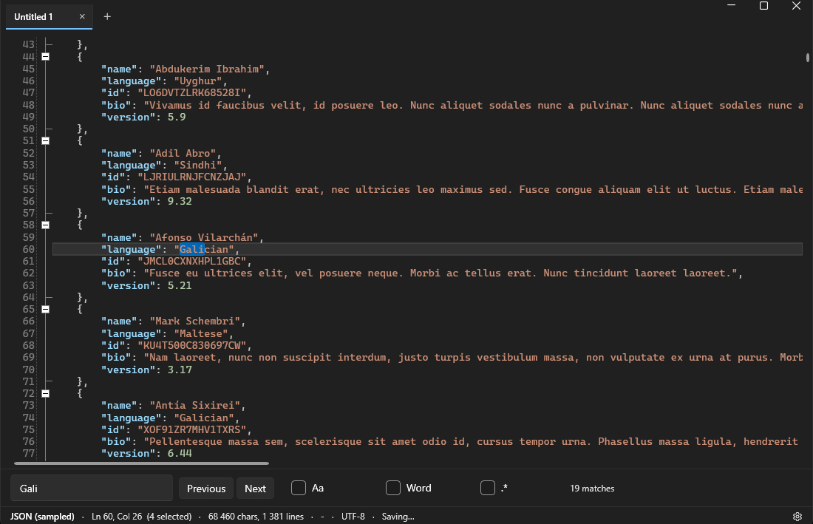

<p align="center">
  
</p>

<h1 align="center">Etch</h1>

<p align="center">
  <b>A fast Notepad replacement for Windows that knows what you just pasted.</b>
</p>

<p align="center">
  <a href="#download">Download</a> ·
  <a href="#what-it-does">What it does</a> ·
  <a href="#keyboard">Keyboard</a> ·
  <a href="#where-your-text-lives">Where your text lives</a> ·
  <a href="#security-posture">Security</a> ·
  <a href="#licence">Licence</a>
</p>

<p align="center">
  
  
  
  
</p>

---

Notepad is where a thought goes to be lost. Etch is the opposite: **nothing is ever
unsaved, and closing a tab is not destructive.** There is no save dialog, because there
is nothing to save.

Then it does the other thing you actually wanted. Paste a JWT and it says *JWT*. Press
`Ctrl+Enter` and it is decoded - in the same buffer, so the next transform picks up where
that one left off. Base64 → JSON → sorted keys is three keystrokes and no round trip
through a website you had to trust with the payload.

<p align="center">
  
</p>

<p align="center">
  <sub>A scratch tab holding JSON. The strip lives in the title bar; the status bar names
  what the buffer was detected as, and says <i>Saving…</i> because it always is.</sub>
</p>

---

## Download

**[Download Etch-Setup.exe](https://github.com/HendrikVrey/Etch/releases/download/latest/Etch-Setup.exe)**
- one installer carrying both `win-x64` and `win-arm64`.

That link is permanent and always serves the newest build of `master`. Every merge
rebuilds it, and nothing is published unless the test suite passes, so a broken commit
leaves the previous installer in place rather than replacing it. The version it reports
looks like `0.1.0-dev.47`, which is the base version plus the build that produced it.

> **Etch has not been tagged yet**, so there is no fixed release to pin to yet. Once
> there is, versioned releases will appear on the
> [Releases](https://github.com/HendrikVrey/Etch/releases) page and
> `releases/latest/download/Etch-Setup.exe` will serve the newest of those - GitHub's
> `/latest/` deliberately skips prereleases, which is what keeps the two links apart.

The installer is **per-user**. It asks for no administrator rights and shows no UAC
prompt, it installs to `%LOCALAPPDATA%\Programs\Etch`, and everything it writes to the
registry is under `HKEY_CURRENT_USER`. No other account on the machine is touched, and
there is no service and nothing that runs at startup.

It asks two questions, and both are reversible afterwards from `Ctrl+,`:

- **Make Etch the default for `.txt`, `.json` and `.log`.** If Windows already has a
  default recorded for one of those, it keeps it - Etch is added to the "Open with" list
  instead, and you finish the change in Settings → Apps → Default apps. That is Windows
  protecting a choice you made, not the installer failing.
- **Add "Open with Etch" when you right-click any file.** On Windows 11 it appears under
  "Show more options".

Installing Etch puts it in Windows' own **"Open with"** submenu for those three types
whether or not you tick either box. Unticking a type in `Ctrl+,` later removes it from
that submenu as well, which is the honest reading of "stop opening these with Etch" -
re-tick it to get both back.

Windows SmartScreen will warn you the first time, because nothing here is code-signed.
That is a real warning and worth treating as one: it means Windows cannot confirm who
built this. Expect it to be **more insistent for an installer** than it is for a bare
executable - SmartScreen weights installers more heavily. If that is not a trade you want
to make, [build it yourself](#build-it-yourself) - the source is right here, and that is
rather the point.

There is no portable ZIP. Building it yourself is the no-install route.

---

## What it does

### Nothing is ever unsaved

Every edit is written about half a second after you stop typing, and at least every five
seconds while you keep going. Close a tab and it goes to the trash, not to nothing -
`Ctrl+Shift+T` brings it back. Kill the process, pull the power, restart the machine: the
tabs come back as they were, with the caret and scroll position where you left them.

For a tab you would rather not have on disk at all, `Ctrl+Shift+E` marks it
**ephemeral**: never journaled, never trashed, never named in the session file.

### It works out what the buffer is

JSON, NDJSON, base64, base64url, hex, URL-encoded, JWT, GUID, Unix time and ISO-8601.
The status bar names what it found, and says *(sampled)* when the document was big enough
that only its first 64 KB was read - because a chip that just said "JSON" would be
claiming the whole file had been checked when it had not.

Detection runs on a debounce, off the UI thread, never on a keystroke.

### `Ctrl+Enter` does the obvious thing

| The buffer is | `Ctrl+Enter` does |
|---|---|
| JSON | Format |
| base64 / base64url | Decode |
| URL-encoded | Decode |
| hex | To text |
| JWT | Decode |
| Unix time | To ISO-8601 |
| ISO-8601 | To Unix time |

Encoding and hashing are never the *suggested* action. Decoding is something the buffer
tells you it needs; encoding is something you go looking for.

Transforms apply **in place**, so they chain. With a selection, only the selection is
transformed. Each one is a single undo.

**Right-click the editor** and the same ready transforms are listed there, marked with
the same green dot the palette uses, above the ordinary cut, copy, paste and select all.
Right-clicking does not move the caret, so a row acts on exactly what `Ctrl+Enter` would
have acted on at that moment.

<p align="center">
  
</p>

<p align="center">
  <sub>Right-click on a minified JSON buffer. The green-dotted rows are the ones that
  apply to what is actually in the buffer; the chord is shown on whichever one
  <code>Ctrl+Enter</code> would run.</sub>
</p>

### …and `Ctrl+Shift+P` does the other 42

The full v1 catalogue, fuzzy-searchable and ranked against what is actually in the
buffer: JSON format, minify, validate, sort keys and string escaping; base64, base64url,
URL and HTML-entity encoding both ways; hex to text; JWT decode; MD5, SHA-1, SHA-256,
SHA-512 and a GUID generator; Unix time ↔ ISO-8601 and UTC ↔ local; six case conversions;
and the line and whitespace operations - sort, reverse, dedupe, drop blank lines, join,
split, trim, collapse, tabs ↔ spaces, indent, dedent.

**JWTs are decoded, never verified.** The output says so on its first line, and that is
not decoration: a tool that renders claims as though they were established facts teaches
people to trust attacker-controlled input.

### Syntax highlighting and folding

Fifteen languages by file extension - C#, JavaScript and TypeScript, JSON, XML and XAML,
HTML, CSS, Java, C and C++, Python, PowerShell, SQL, PHP, Visual Basic, Markdown and
unified diffs. Scratch tabs are highlighted from what detection found, which today means
JSON.

The colours are Etch's own, not the grammar's, and every one is held to **4.5:1 contrast**
against the page in both themes. That is asserted by a test rather than by looking at it,
because "looks fine on my machine" is exactly how the bundled grammars ended up
unreadable on a dark background in the first place.

Brace folding for the C family and JSON; XML and HTML fold as markup.

### Big files degrade honestly

| Size | What changes |
|---|---|
| up to 2 MiB | everything on |
| 2–10 MiB | folding off, detection stops re-running as you type |
| 10–100 MiB | plain text, and **auto-save off** |
| over 100 MiB | refused, with the size in the message |

The 10 MiB tier is the one worth knowing: above it Etch stops journaling, so the promise
at the top of this page no longer holds - and the status bar says so plainly rather than
quietly dropping it.

<p align="center">
  
</p>

<p align="center">
  <sub><code>Ctrl+F</code> with a live match count, and the <i>(sampled)</i> chip in the
  status bar - the document was large enough that detection read only its first 64 KB, and
  it says so rather than claiming the whole file.</sub>
</p>

---

## Keyboard

| Key | Action |
|---|---|
| `Ctrl+T` / `Ctrl+N` | New scratch tab |
| `Ctrl+W` | Close tab - never destructive |
| `Ctrl+Shift+T` | Reopen the last closed tab |
| `Ctrl+Tab` / `Ctrl+Shift+Tab` | Next / previous tab |
| `Ctrl+PageDown` / `Ctrl+PageUp` | Next / previous tab |
| `Ctrl+1..9` | Jump to a tab by position |
| `Ctrl+O` | Open a file |
| `Ctrl+S` | Write through - or give a scratch tab a home |
| `Ctrl+F` / `Ctrl+H` | Find / find and replace |
| `Ctrl+Enter` | Do the obvious thing to the buffer |
| `Ctrl+Shift+P` | Command palette |
| `F2` | Rename the tab, in place |
| `Ctrl+Shift+E` | Toggle ephemeral |
| `Ctrl+K, P` | Pin or unpin the tab |
| `Ctrl+,` | Settings - or the gear at the far right of the status bar |
| `Esc` | Dismiss the palette, the settings panel or the find bar |

Everything the text area owns - cut, copy, paste, undo, redo, select all, caret and
selection keys, `Tab` for indentation - is left alone deliberately. The whole map is one
table in `Etch.App.Input.KeyMap`, and a test asserts both that it matches this list and
that it claims nothing the editor owns.

---

## Opening files with Etch

The installer asks about this once. `Ctrl+,` → "Open these with Etch" is where you change
your mind: `.txt`, `.json` and `.log`, and nothing else - every other file type has a real
editor behind it.

Below it, **"Show \"Open with Etch\" when you right-click any file"** adds and removes the
Explorer right-click entry, the same one the installer offers. It reads back as ticked
only while it still points at the copy of Etch you are running, so a build that has since
moved shows as unticked and re-ticking repairs it.

The registration is **per-user**: everything is written under `HKEY_CURRENT_USER`, no
other account on the machine is affected, and no elevation is asked for - by the
installer, the uninstaller or this panel. Unticking a box restores whatever was
registered before Etch, rather than leaving the type with no handler.

One caveat worth stating plainly, because it is Windows' behaviour and not a bug in
Etch: if you have ever chosen a default application for one of these extensions, Windows
records that choice in a hash-protected key that no application is permitted to write.
Etch does not try. In that case ticking the box adds Etch to the **"Open with"** list and
says so, and making it the default is done in Settings → Apps → Default apps.

### Tabs

The strip lives in the title bar, alongside one `+` button and nothing else - no menu, no
ribbon, no toolbar. Settings is a gear at the far right of the status bar.
Drag to reorder; pinned tabs are a separate group, so a drag never pins anything by
accident. Right-click for pin, rename, ephemeral and close. The strip scrolls on the
wheel when there are more tabs than fit, with no scrollbar, because `Ctrl+Tab` and
`Ctrl+1..9` reach everything anyway.

---

## Where your text lives

```
%LOCALAPPDATA%\Etch\
├─ session.json          tab order, titles, caret and scroll positions
├─ .lock                 held by the running instance
├─ buffers\<guid>.txt    one file per tab, raw UTF-8
├─ buffers\<guid>.prev   the previous revision of each, kept as a safety net
└─ trash\<guid>.txt      closed tabs, kept 7 days
```

**Only one Etch runs per data directory.** Two would journal to the same files and
overwrite each other with no error anywhere. A second launch hands its file to the window
already open and exits.

---

## Security posture

Every buffer is untrusted input, even on the desktop.

Paths from the command line are resolved to absolute form, device paths (`\\.\`, `\\?\`)
are refused, nothing reaches a shell, hyperlink detection in the editor is off, reads are
bounded, and the instance hand-off uses a named pipe restricted to the current user with
every path revalidated on arrival.

**Etch initiates no network requests** - no telemetry, no update check, no crash
reporting, nothing. Opening a UNC path does SMB I/O exactly as any Windows file open
does; that is your request, not Etch reaching out. Command-line parsing touches no
filesystem at all, so a hostile path cannot hang startup on a network timeout before the
window even exists.

### Your text is stored as plaintext

People paste credentials into scratchpads, so this deserves to be precise rather than
reassuring:

- Each buffer is stored **twice** - the current text and one previous revision
  (`.prev`), kept so a bad write is recoverable. A wipe removes both.
- Because every revision is written to a fresh file and renamed into place, **older
  copies of your text remain on disk** until their blocks are reused. Deleting a file
  unlinks it; it is not a secure erase, and Volume Shadow Copy keeps whole prior
  versions.
- Diagnostic logs under `%LOCALAPPDATA%\Etch\diag` record absolute paths, which means
  usernames and directory names. They roll at 4 MB.
- The honest answer for a real secret is **not to write it at all** - which is what
  `Ctrl+Shift+E` is for.

Trash retention defaults to **7 days** and is set in `Ctrl+,` → Storage. Zero is a
supported value and means what it says: a closed tab's text is deleted rather than
trashed, so `Ctrl+Shift+T` cannot bring it back. **"Wipe all scratch data"** is in the
same panel, under Privacy; it needs pressing twice, and it removes every buffer, both
revisions of each, the trash and the tab list. Read the bullets above before relying on
it - it unlinks files, which is not the same as erasing them.

Your settings live in `%LOCALAPPDATA%\Etch\settings.json`, which a wipe deliberately does
**not** remove: it holds preferences, no paths and no fragment of any buffer, and
resetting a retention window of zero because someone wiped their scratch data would be
precisely the wrong thing to do to the person most likely to have chosen it.

---

## Build it yourself

```powershell
dotnet build Etch.slnx -c Release
dotnet test  Etch.slnx
```

Publish the way it actually ships - a debug build through `dotnet run` is not the thing
anyone launches:

```powershell
dotnet publish src\Etch.App\Etch.App.csproj -c Release -r win-x64 `
  --self-contained true -p:PublishSingleFile=true -p:PublishReadyToRun=true `
  -o artifacts\win-x64
```

Requires the .NET 10 SDK and Windows. Single-file compression is off permanently - it
trades startup time for file size by decompressing on every launch, and Etch sells startup
time. Trimming is off too: WPF resolves types from XAML by reflection, so trimming breaks
it in ways that only surface at runtime.

`artifacts\win-x64\Etch.exe` is then a complete, self-contained Etch. Nothing has to be
installed to run it, which is what makes this the no-install route now that the portable
ZIP is gone.

To build the installer as well you need [Inno Setup](https://jrsoftware.org/isinfo.php) on
`PATH`, and the payload published to the two paths the script expects:

```powershell
dotnet publish src\Etch.App\Etch.App.csproj -c Release -r win-x64 `
  --self-contained true -p:PublishSingleFile=true -p:PublishReadyToRun=true `
  -o publish\win-x64
dotnet publish src\Etch.App\Etch.App.csproj -c Release -r win-arm64 `
  --self-contained true -p:PublishSingleFile=true -p:PublishReadyToRun=true `
  -o publish\win-arm64
iscc installer\Etch.iss /DAppVersion=0.1.0
```

That writes `dist\Etch-Setup.exe`. The release workflow in
[`.github/workflows/release.yml`](.github/workflows/release.yml) runs exactly these steps
on a tag.

### Command line

```
Etch [file]                Open a file.
Etch --diag                Print the startup timeline and continue.
Etch --gen-sample <path>   Write a synthetic file, then exit.
       [--size <MiB>]      Target size. Default 50, max 2048.
       [--shape json|text] Content shape. Default json.
       [--force]           Replace an existing file at that path.
Etch --help
```

Diagnostics print to the terminal *and* append to
`%LOCALAPPDATA%\Etch\diag\etch-<date>.log`, so a run launched from Explorer, or one that
dies early, still leaves the numbers behind.

---

## How it is put together

```
src/Etch.Core          pure functions over text - no UI, no I/O, no platform
src/Etch.Persistence   every byte Etch writes: buffers, trash, session index, journal
src/Etch.App           WPF shell, tabs, find/replace, single-instance, diagnostics
tests/                 three suites, one per project
assets/                the icon: SVG sources, the packed .ico, and build-icon.py
```

`Etch.Core` is where the value of the product lives, which is why it takes no
`PackageReference`, no UI reference and no I/O: it stays exhaustively testable without a
window. If a `using System.Windows` ever appears in it, something has gone wrong.

It is also packaged, so a sibling tool can run the same transform chain over its own
buffers: **to a private feed, not to nuget.org.** A public package would put a copy of
Etch inside every consumer's build output, which the licence below does not permit;
[docs/packaging.md](docs/packaging.md) has the reasoning and the mechanics. If you want to
build something on it, section 11 of the licence says to ask.

| Piece | Choice |
|---|---|
| Framework | .NET 10, WPF |
| Fluent shell | [WPF UI](https://github.com/lepoco/wpfui) 4.3.0 |
| Editor | [AvalonEdit](https://github.com/icsharpcode/AvalonEdit) 6.3.1 |
| Tests | xUnit v3 |

A few decisions that are load-bearing rather than incidental:

- **Etch owns its own `Main`,** so the clock starts before the `Application` object and
  its XAML resource dictionaries exist. Those dictionaries are the largest controllable
  cost in a WPF-UI startup, and a timeline that cannot see them separately cannot tell you
  whether to cut them.
- **No polling timers.** Idle CPU is a budget, not an aspiration. Timers are created on
  first use, fire once, and stop themselves.
- **The size ceiling is enforced on the handle being read,** not on a `FileInfo` snapshot
  taken earlier. A log file another process is still appending to is the likeliest input
  this editor sees, and the one most able to win that race.
- **The theme is applied, not guessed** - read from the registry, then handed to WPF-UI
  unconditionally, because skipping the call when it already matches would also skip the
  DWM dark-mode window attribute and leave a light frame around dark content.

---

## Licence

Etch is **source-available, not open source**.

You may read the code, download it, build it, and run it for anything - including at
work, commercially, free of charge. You may **not** modify it, republish it, or sell it.
The full terms are in [`LICENSE`](LICENSE), and they are short enough to actually read.

Bug reports and feature requests are welcome. Pull requests are not, and the licence says
why rather than leaving you to find out in a comment.

Etch is built on MIT-licensed components - AvalonEdit, WPF UI and the .NET runtime -
whose licences are reproduced in [`THIRD-PARTY-NOTICES.md`](THIRD-PARTY-NOTICES.md) and
ship with every release. Nothing in Etch's licence restricts your rights under theirs.

Versions up to and including commit `c9bc42a` were published under the MIT Licence. That
grant stands for those versions.

<p align="center">
  <sub>Copyright © 2026 Hendrik Vrey</sub>
</p>
